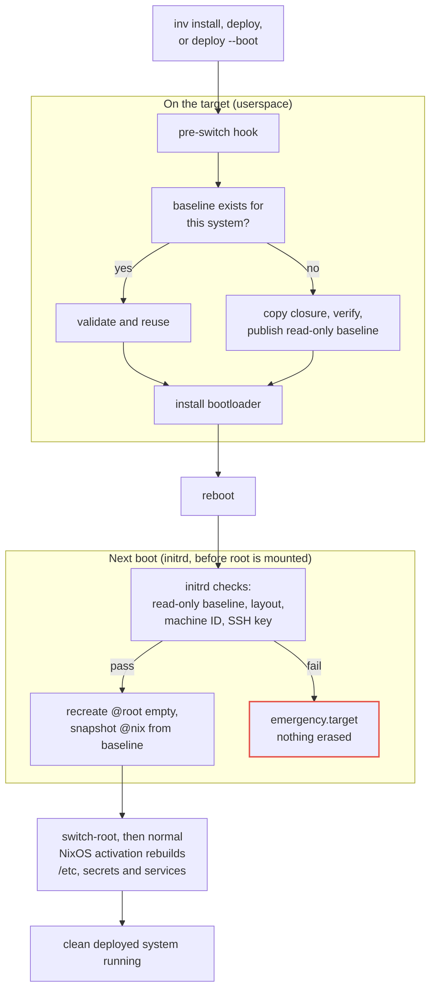

<!--
SPDX-FileCopyrightText: 2026 TII (SSRC) and the Ghaf contributors
SPDX-License-Identifier: CC-BY-SA-4.0
-->

# Baseline reset

Baseline reset returns a compatible NixOS host to a clean deployed state on
every boot while preserving normal NixOS deployment. Runtime changes to the
root filesystem and Nix store, including service and local build state, are
discarded.

Deployment saves the system's Nix store closure as a read-only btrfs baseline.
During boot, the initrd creates a fresh root and replaces `/nix` with the
baseline for the generation selected by the bootloader. This runs before the
root filesystem is mounted, so an unclean shutdown cannot skip it. The machine
ID and ed25519 SSH host key survive under `/var/lib/baseline-reset`; separately
mounted service volumes are not reset.

This provides stable host identity, normal `deploy` updates, and selectable
generations. It is an operational reset mechanism, not an immutable or
cryptographically ephemeral system.

Baseline reset is currently enabled on the ci-dbg hosts: the `hetzci-dbg`
controller and its `hetz86-dbg-1` and `hetzarm-dbg-1` builders.

## Installation

A host with baseline reset enabled needs three btrfs subvolumes: `@root` at
`/`, `@nix` at `/nix`, and `@persist` at `/var/lib/baseline-reset`. It also
needs a separate vfat `/boot`. In this repository, enabling or disabling
baseline reset changes the disk layout between ext4 and btrfs. A deployment
cannot make that transition; reinstall the host with:

```sh
inv install --alias HOST
```

`inv install` repartitions and erases the target disk. The installer preserves
the configured SSH identity and establishes the initial btrfs baseline.

## Updates

After initial installation, use a normal deployment followed by a reboot:

```sh
deploy .#HOST
inv reboot HOST
```

Deploy activates the new userspace immediately, but the host keeps its previous
kernel and mutable state until reboot.

To leave the running host unchanged until reboot, use a boot-only deployment:

```sh
deploy --boot .#HOST
inv reboot HOST
```

## Saving and restoring baselines

An installation or deployment saves the baseline; the following boot restores
from it. The bootloader is written only after the baseline has been published,
and the initrd completes every check before it erases anything. Each baseline is
named after the Nix store hash of its system, so the entry selected in the boot
menu decides which one is restored.

| Command | Saves a baseline | Activation action |
|---|---:|---|
| `inv install --alias HOST` | Yes | The installer runs `switch-to-configuration boot` |
| `deploy .#HOST` | Yes | `switch` |
| `deploy --boot .#HOST` | Yes | `boot` |
| `inv reboot HOST` | No | The initrd restores from the baseline selected by the bootloader |

When `switch-to-configuration` runs, NixOS uses a pre-switch hook to save the
baseline before updating the bootloader.

The deployment command saves the baseline, and the subsequent reboot restores
from it. If a baseline for the exact system already exists, the pre-switch
check validates and reuses it instead of copying the closure again.



## Features and known limitations

Baseline reset provides cleanliness between boots, not a security boundary:

| Property | baseline-reset |
|---|---|
| Reset on every boot | `/` (`@root`) is recreated empty with the machine ID restored. `/nix` (`@nix`) is replaced by the btrfs baseline for the selected generation |
| Preserved by the module | `/var/lib/baseline-reset` (`@persist`). The machine ID is always required; the SSH host key is required when OpenSSH is enabled. Anything else written there also persists |
| Outside the reset | `/boot`, which holds the bootloader, the generation menu, and the kernel and initrd that perform the reset. Plus separately mounted service volumes, such as the controller's `/var/lib/caddy` |
| Build and Jenkins state | Discarded. Push required artifacts off-host before rebooting, for example to Cachix or the OCI registry |
| Boot chain | No Secure Boot, dm-verity, measured boot, or attestation. The current update workflow needs `/boot` writable during activation, when the bootloader installers write the kernel, initrd and boot entries |
| Root of trust | None: the running system and the disk are trusted. Baselines are read-only btrfs subvolumes, but host root can clear that flag and alter them |
| Erasure | Deleted, not securely erased; may remain forensically recoverable |
| Deployment rollback | Do not rely on deploy-rs automatic or magic rollback; redeploy explicitly or select another generation from the console |
| Platform requirements | Supported btrfs and boot layouts; no disk swap or NixOS specialisations |

## Future improvements

| Improvement | Effect and requirements |
|---|---|
| Preserved by the module | An explicit allowlist would stop state left under `/var/lib/baseline-reset` from persisting unnoticed. It would narrow one of several surviving paths, not all of them, and would not constrain host root. Needs only a module change |
| Tamper evidence | Off-host digests would record what a baseline and `/boot` should contain. Comparing the on-disk contents against those digests would catch accidental corruption and support forensics after an incident. The comparison would not prove what a host actually booted, which would need hardware measurement or reading the disk from outside the host. Requires further design |
| Boot chain | A tampered kernel or initrd would fail to boot, so the reset could not be skipped. Needs UEFI Secure Boot, which most current Hetzner CI hosts lack |
| Root of trust | Host root could no longer alter a btrfs baseline undetected. Needs a verified boot chain, plus dm-verity or baseline signatures checked from it, so the Secure Boot requirement applies here too |
| Erasure | Discarded root and store data would be unrecoverable rather than merely deleted, because the key that encrypted it is gone. Needs the baselines on persistent storage and the writable layer on a volume encrypted with a fresh in-memory key each boot. No new host capabilities, but the layout change means reinstalling hosts already using baseline reset |
