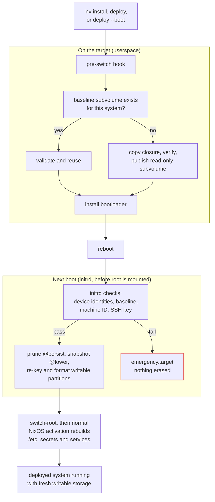

<!--
SPDX-FileCopyrightText: 2026 TII (SSRC) and the Ghaf contributors
SPDX-License-Identifier: CC-BY-SA-4.0
-->

# Baseline reset

Baseline reset discards changes to the root filesystem and Nix store on every
boot, including service state and local builds. Normal NixOS deployment and
selectable generations keep working. The reset relies on the boot code and the
deployed baseline being trustworthy, so rebooting alone cannot guarantee
recovery from a root compromise.

Deployment copies the system's Nix store closure into a read-only btrfs
subvolume. During boot, the initrd selects that baseline, recreates a fixed
read-only `@lower` snapshot, and formats the writable root with a fresh random
LUKS2 key. An OverlayFS mount at `/nix` puts writable Nix data on the encrypted
root, or on a separate encrypted Nix partition when configured. This runs
before the root filesystem is mounted, so an unclean shutdown cannot skip it.
The machine ID and ed25519 SSH host key survive under
`/var/lib/baseline-reset`; separately mounted service volumes are not reset.

The per-boot keys are lost at power-off, so discarded writes cannot be read
back from the local disks afterwards. See the
[limits below](#features-and-known-limitations).

Baseline reset is enabled on the ci-dbg and ci-release controllers and their
builders. Test agents are not reset.

## Installation

The encrypted layout keeps host identity and deployed baselines on persistent
storage, while root and Nix writes use fresh encryption keys on every boot.
Writable partitions have fixed GPT PARTUUIDs, so a boot interrupted during LUKS
formatting can be retried even if the LUKS header is missing. The reset accepts
LUKS or no recognized signature on these partitions and rejects other contents.
The x86 release builder has a separate encrypted Nix partition. A deployment
cannot change the disk layout; install or reinstall a host with this layout:

```sh
inv install --alias HOST
```

`inv install` repartitions and erases the target disk. The installer preserves
the configured SSH identity and establishes the initial read-only baseline.

Install all three ci-release hosts and establish their first credential epoch
with:

```sh
inv install-release --reinstall
```

## Updates

After initial installation, use a normal deployment followed by a reboot:

```sh
deploy .#HOST
inv reboot HOST
```

Deploy activates the new userspace immediately, but the host keeps its previous
kernel and mutable state until reboot.

To leave the running host unchanged until reboot, use a boot-only deployment:

```sh
deploy --boot .#HOST
inv reboot HOST
```

The normal release flow always uses `inv install-release`; it deploys a new
baseline and resets the existing hosts without repartitioning them. The three
available modes are:

- `inv install-release`: deploy the current checkout to all three hosts,
  reset them in parallel, and start a fresh credential epoch (a CA and set of
  builder credentials that this run creates and the next run entirely
  replaces). The task also deploys the release test agent. The normal choice
  for each release.
- `inv install-release --no-deploy`: reset the already deployed systems in
  parallel and start a fresh credential epoch, without publishing a new
  baseline.
- `inv install-release --reinstall`: erase and reinstall all three hosts in
  parallel and redeploy the test agent. Use this only for first-time setup or
  when a disk layout change requires repartitioning; it is not part of a normal
  release.

Deploying or reinstalling requires a clean checkout of tracked files so the
recorded Git revision exactly identifies the deployed configuration. Untracked
files are ignored.

Without `--reinstall`, the task aborts without changes if a host's disk layout
doesn't match what baseline reset expects. `--no-deploy` also aborts if a host
has a deployment waiting for its next boot.

A controller reboot outside these commands still needs a follow-up
`inv install-release`: its credentials live only in `/run` and don't survive
reboot. Jenkins starts normally, but builds using remote builders need fresh
credentials. A builder reboot doesn't, since it only keeps the (non-secret)
trusted CA.

The x86 release builder keeps Hetzner's PXE entries first in its persistent
UEFI boot order so Robot rescue remains available. For its task-controlled
reset, `inv install-release` uses the currently running local-disk entry as the
one-shot `BootNext` entry, avoiding slow PXE timeouts without changing the
persistent boot order.

## Publishing and restoring baseline subvolumes

An installation or deployment publishes a read-only baseline subvolume; the
following boot recreates `@lower` from it and formats the writable partitions
with new keys. The bootloader is written only after the subvolume has been
published. The initrd checks the baseline and required host identity before
pruning `@persist` and formatting the writable partitions.
Each baseline subvolume is named after the Nix store hash of its system, so the
entry selected in the boot menu decides which one is restored.

| Command | Publishes a baseline subvolume | Activation action |
|---|---:|---|
| `inv install --alias HOST` | Yes | The installer runs `switch-to-configuration boot` |
| `inv install-release` | Yes | Boot-deploys and resets ci-release, then provisions credentials |
| `inv install-release --no-deploy` | No | Resets the deployed ci-release systems and provisions credentials |
| `inv install-release --reinstall` | Yes | Repartitions and reinstalls all three ci-release hosts, then provisions credentials |
| `deploy .#HOST` | Yes | `switch` |
| `deploy --boot .#HOST` | Yes | `boot` |
| `inv reboot HOST` | No | The initrd snapshots the baseline subvolume selected by the bootloader |

When `switch-to-configuration` runs, NixOS uses a pre-switch hook to publish the
baseline subvolume before updating the bootloader.

The deployment command publishes the baseline subvolume, and the subsequent
reboot creates a read-only `@lower` snapshot from it. If a subvolume for the exact
system already exists, the pre-switch check validates and reuses it instead of
copying the closure again.


```mermaid
flowchart TD
  A["inv install, deploy,<br/>or deploy --boot"] --> B

  subgraph SAVE ["On the target (userspace)"]
    direction LR
    B["pre-switch hook"] --> C["baseline subvolume exists<br/>for this system?"]
    C -- yes --> D["validate and reuse"]
    C -- no --> E["copy closure, verify,<br/>publish read-only subvolume"]
    D --> H["install bootloader"]
    E --> H
  end

  H --> R["reboot"]
  R --> J

  subgraph BOOT ["Next boot (initrd, before root is mounted)"]
    direction LR
    J["initrd checks:<br/>device identities, baseline,<br/>machine ID, SSH key"] -- pass --> K["prune @persist, snapshot @lower,<br/>re-key and format writable partitions"]
    J -- fail --> L["emergency.target<br/>nothing erased"]
  end

  K --> N["switch-root, then normal<br/>NixOS activation rebuilds<br/>/etc, secrets and services"]
  N --> M["deployed system running<br/>with fresh writable storage"]

  classDef failure stroke:#e5534b,stroke-width:2px
  class L failure
```

## Features and known limitations

| Property | baseline-reset |
|---|---|
| Reset on every boot | Root and writable Nix state are recreated with fresh LUKS2 keys, and `/nix` overlays the selected read-only baseline. Once the old keys are gone, discarded writes cannot be recovered from the local disks |
| Preserved state | The machine ID and SSH host key under `/var/lib/baseline-reset` (`@persist`), plus the release builders' public CA on those hosts. Other entries are removed by the initrd on reset |
| Outside the reset | `/boot` (bootloader, generation menu, kernel and initrd) and separately mounted service volumes, such as the controller's `/var/lib/caddy` |
| Build and Jenkins state | Discarded. Push required artifacts off-host before rebooting, for example to Cachix or the OCI registry |
| Boot chain | No Secure Boot, measured boot or attestation, so root can replace the kernel or initrd that performs the reset. The release task checks boot IDs and system paths over SSH, but a compromised host can report whatever it wants. See [Hetzner limitations](#hetzner-limitations) |
| Baseline integrity | No dm-verity or signature check on the baseline contents. Root can clear the btrfs read-only flag and modify a baseline. Checking the baseline at boot would also need a trusted boot path (see [Hetzner limitations](#hetzner-limitations)) |
| Credentials | `inv install-release` rotates the builder CA and the controller's builder keys. It does not rotate SSH host keys or service credentials stored in SOPS. A reset does not revoke stolen credentials |
| Reinstallation | `inv install-release --reinstall` repartitions the configured disks, but it starts the installer from the running OS over SSH and `kexec`. A compromised OS can interfere with that, so a successful reinstall does not prove the host is clean. See the [install task](../tasks.py) |
| Deployment rollback | Do not rely on deploy-rs automatic or magic rollback; redeploy explicitly or select another generation from the console |
| Platform requirements | Supported btrfs and boot layouts, LUKS2 and OverlayFS; no disk swap or NixOS specialisations |

`services.baseline-reset.persistentFiles` lists additional relative regular-file
paths to keep in `@persist`. The machine ID and enabled SSH host key are always
kept independently of this option. Reset stops if an allowed path is a symlink
or cleanup fails.

The reset does not erase preexisting plaintext on reused disks, or copies
already sent to logging and artifact services.
Removing an unlisted file from `@persist` does not securely erase its data from
the persistent btrfs device.

If a host might be compromised, preserve evidence before resetting it. Once the
per-boot keys are gone, a disk image of the writable partitions can no longer
be decrypted.

Logs already sent to [monitoring](monitoring.md) survive a reset. The local
journal and Alloy state are discarded, so anything that has not reached Loki
is lost, even on a clean reboot.

## Hetzner limitations

Boot settings reported by the ci-release hosts over SSH, using DMI data, EFI
variables and `bootctl status`:

| Host | Platform | Boot capabilities |
|---|---|---|
| `hetzci-release` (controller) | Hetzner Cloud, x86 | Legacy BIOS boot; no TPM exposed |
| `hetzarm-rel-1` (ARM builder) | Hetzner Cloud, ARM | UEFI; Secure Boot reported unsupported; no TPM exposed |
| `hetz86-rel-2` (x86 builder) | Dedicated EPYC 9454P, ASUS K14PA-U12 | UEFI; Secure Boot disabled; no TPM exposed |

Hetzner's [Cloud FAQ](https://docs.hetzner.com/cloud/servers/faq/#is-secure-boot-supported)
says Cloud servers support neither Secure Boot nor TPM/vTPM, so the controller
and the ARM builder can use neither, even though the ARM builder boots with
UEFI.

For dedicated servers, Hetzner's
[UEFI policy](https://docs.hetzner.com/robot/dedicated-server/operating-systems/uefi/#secure-boot-support)
lets you enable Secure Boot, but Hetzner doesn't support it, and the Rescue
system and automatic installation stop working once it is on. The
[ASUS manual](https://dlcdnets.asus.com/pub/ASUS/server/K14PA-U12/Manual/E28198_K14PA-U12_UM_V3_WEB.pdf#page=80)
for the x86 builder's board describes Secure Boot with custom key management.
We have not tried enrolling keys, or checked whether Hetzner's firmware build
allows it. Hetzner lists its [RX ARM servers](https://www.hetzner.com/dedicated-rootserver/matrix-rx/)
as unavailable, so that range offers no replacement for the ARM builder.

Using Secure Boot would also need a signed kernel, initrd and command line, an
authenticated baseline, and a boot policy that always runs the reset. The
signing keys, and the decision about which images get signed, have to stay off
the release hosts.

### Alternatives to Secure Boot

SOPS and services that supply secrets cannot, on their own, prove what a host
booted. Hash checks and dm-verity also need a trusted boot path. Without one,
root can replace the code that enforces those checks. An external verifier
cannot rely on the host's own boot reports, because root can falsify them.

TPM measurements could provide evidence of what booted, if the measurement
chain is trusted (see
[Keylime's trust model](https://keylime.readthedocs.io/en/latest/design/security.html)),
but none of the release hosts exposes a TPM. A network boot image or `kexec`
installer only helps if the firmware or an external management system starts
it, not the suspect OS.

Replacing the Cloud VMs from [approved snapshots](https://docs.hetzner.com/cloud/servers/backups-snapshots/overview/),
or booting trusted installation media without going through the installed OS,
could give us a recovery path. Both need a different workflow from the current
one. That assumes we can trust the system creating the new Cloud VMs and
Hetzner's infrastructure. We would still need to revoke and replace exposed
credentials, and check or rebuild any storage reused from the old Cloud VMs.

## Further work

| Improvement | Effect and requirements |
|---|---|
| Tamper evidence | Build digests of `/boot` and the baseline contents independently and keep them off the hosts. After an incident, compare them with disk images taken without booting the suspect OS. This shows what is stored on disk, not what booted or whether secrets were stolen. Needs more design |
| Recovery procedure | Write down and test the steps: isolate the host, collect evidence before rebooting, then recover with a trusted provisioner or installation media booted without the suspect OS. Cover persistent volumes, and revoking and replacing exposed host and service credentials |
| Log delivery before reset | Check that each release host's journal reaches Loki, and wait for pending entries before a routine reset. Decide what a reset should do if Loki is down |
