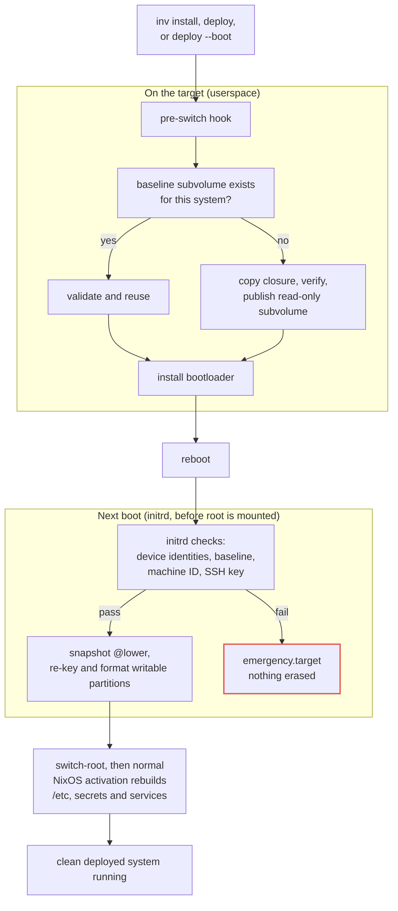

<!--
SPDX-FileCopyrightText: 2026 TII (SSRC) and the Ghaf contributors
SPDX-License-Identifier: CC-BY-SA-4.0
-->

# Baseline reset

Baseline reset returns a compatible NixOS host to a clean deployed state on
every boot while preserving normal NixOS deployment. Runtime changes to the
root filesystem and Nix store, including service and local build state, are
discarded.

Deployment copies the system's Nix store closure into a read-only btrfs
subvolume. During boot, the initrd selects that baseline, recreates a fixed
read-only `@lower` snapshot, and formats the writable root with a fresh random
LUKS2 key. An OverlayFS mount at `/nix` puts writable Nix data on the encrypted
root, or on a separate encrypted Nix partition when configured. This runs
before the root filesystem is mounted, so an unclean shutdown cannot skip it.
The machine ID and ed25519 SSH host key survive under
`/var/lib/baseline-reset`; separately mounted service volumes are not reset.

This provides stable host identity, normal `deploy` updates, and selectable
generations. Lost per-boot keys make discarded local writable data
unrecoverable after power-off, subject to the [limits below](#features-and-known-limitations).

Baseline reset is enabled on the ci-dbg and ci-release controllers and their
builders. Test agents are not reset.

## Installation

The encrypted layout keeps host identity and deployed baselines on persistent
storage, while root and Nix writes use fresh encryption keys on every boot.
Writable partitions have fixed GPT PARTUUIDs, so a boot interrupted during LUKS
formatting can be retried even if the LUKS header is missing. The reset accepts
LUKS or no recognized signature on these partitions and rejects other contents.
The x86 release builder has a separate encrypted Nix partition. A deployment
cannot change the disk layout; install or reinstall a host with this layout:

```sh
inv install --alias HOST
```

`inv install` repartitions and erases the target disk. The installer preserves
the configured SSH identity and establishes the initial read-only baseline.

Install all three ci-release hosts and establish their first credential epoch
with:

```sh
inv install-release --reinstall
```

## Updates

After initial installation, use a normal deployment followed by a reboot:

```sh
deploy .#HOST
inv reboot HOST
```

Deploy activates the new userspace immediately, but the host keeps its previous
kernel and mutable state until reboot.

To leave the running host unchanged until reboot, use a boot-only deployment:

```sh
deploy --boot .#HOST
inv reboot HOST
```

The normal release flow always uses `inv install-release`; it deploys a new
baseline and resets the existing hosts without repartitioning them. The three
available modes are:

- `inv install-release`: deploy the current checkout to all three hosts,
  reset them in parallel, and start a fresh credential epoch (a CA and set of
  builder credentials that this run creates and the next run entirely
  replaces). The task also deploys the release test agent. The normal choice
  for each release.
- `inv install-release --no-deploy`: reset the already deployed systems in
  parallel and start a fresh credential epoch, without publishing a new
  baseline.
- `inv install-release --reinstall`: erase and reinstall all three hosts in
  parallel and redeploy the test agent. Use this only for first-time setup or
  when a disk layout change requires repartitioning; it is not part of a normal
  release.

Deploying or reinstalling requires a clean checkout of tracked files so the
recorded Git revision exactly identifies the deployed configuration. Untracked
files are ignored.

Without `--reinstall`, the task aborts without changes if a host's disk layout
doesn't match what baseline reset expects. `--no-deploy` also aborts if a host
has a deployment waiting for its next boot.

A controller reboot outside these commands still needs a follow-up
`inv install-release`: its credentials live only in `/run` and don't survive
reboot. Jenkins starts normally, but builds using remote builders need fresh
credentials. A builder reboot doesn't, since it only keeps the (non-secret)
trusted CA.

The x86 release builder keeps Hetzner's PXE entries first in its persistent
UEFI boot order so Robot rescue remains available. For its task-controlled
reset, `inv install-release` uses the currently running local-disk entry as the
one-shot `BootNext` entry, avoiding slow PXE timeouts without changing the
persistent boot order.

## Publishing and restoring baseline subvolumes

An installation or deployment publishes a read-only baseline subvolume; the
following boot recreates `@lower` from it and formats the writable partitions
with new keys. The bootloader is written only after the subvolume has been
published, and the initrd completes every check before it erases anything.
Each baseline subvolume is named after the Nix store hash of its system, so the
entry selected in the boot menu decides which one is restored.

| Command | Publishes a baseline subvolume | Activation action |
|---|---:|---|
| `inv install --alias HOST` | Yes | The installer runs `switch-to-configuration boot` |
| `inv install-release` | Yes | Boot-deploys and resets ci-release, then provisions credentials |
| `inv install-release --no-deploy` | No | Resets the deployed ci-release systems and provisions credentials |
| `inv install-release --reinstall` | Yes | Repartitions and reinstalls all three ci-release hosts, then provisions credentials |
| `deploy .#HOST` | Yes | `switch` |
| `deploy --boot .#HOST` | Yes | `boot` |
| `inv reboot HOST` | No | The initrd snapshots the baseline subvolume selected by the bootloader |

When `switch-to-configuration` runs, NixOS uses a pre-switch hook to publish the
baseline subvolume before updating the bootloader.

The deployment command publishes the baseline subvolume, and the subsequent
reboot creates a read-only `@lower` snapshot from it. If a subvolume for the exact
system already exists, the pre-switch check validates and reuses it instead of
copying the closure again.


```mermaid
flowchart TD
  A["inv install, deploy,<br/>or deploy --boot"] --> B

  subgraph SAVE ["On the target (userspace)"]
    direction LR
    B["pre-switch hook"] --> C["baseline subvolume exists<br/>for this system?"]
    C -- yes --> D["validate and reuse"]
    C -- no --> E["copy closure, verify,<br/>publish read-only subvolume"]
    D --> H["install bootloader"]
    E --> H
  end

  H --> R["reboot"]
  R --> J

  subgraph BOOT ["Next boot (initrd, before root is mounted)"]
    direction LR
    J["initrd checks:<br/>device identities, baseline,<br/>machine ID, SSH key"] -- pass --> K["snapshot @lower,<br/>re-key and format writable partitions"]
    J -- fail --> L["emergency.target<br/>nothing erased"]
  end

  K --> N["switch-root, then normal<br/>NixOS activation rebuilds<br/>/etc, secrets and services"]
  N --> M["clean deployed system running"]

  classDef failure stroke:#e5534b,stroke-width:2px
  class L failure
```

## Features and known limitations

Baseline reset provides cleanliness between boots and confidentiality of
discarded writable data after power-off, with these limits:

| Property | baseline-reset |
|---|---|
| Reset on every boot | `/` is a freshly keyed LUKS2 and btrfs filesystem with the machine ID restored. `/nix` overlays the selected read-only baseline with upper and work directories on encrypted btrfs |
| Preserved by the module | `/var/lib/baseline-reset` (`@persist`). The machine ID is always required; the SSH host key is required when OpenSSH is enabled. Release builders also keep the current public builder CA. Anything else written there also persists |
| Outside the reset | `/boot`, which holds the bootloader, the generation menu, and the kernel and initrd that perform the reset. Plus separately mounted service volumes, such as the controller's `/var/lib/caddy` |
| Build and Jenkins state | Discarded. Push required artifacts off-host before rebooting, for example to Cachix or the OCI registry |
| Boot chain | No Secure Boot, dm-verity, measured boot, or attestation. Bootloader installation writes the kernel, initrd and boot entries to `/boot` during activation |
| Root of trust | None: the running system and the disk are trusted. Baselines are read-only btrfs subvolumes, but host root can clear that flag and alter them |
| Erasure | Discarded root and Nix writes are unreadable from local disks after the per-boot keys are lost. `/boot`, persistent volumes, shipped logs and artifacts, and preexisting plaintext on reused disks are not covered |
| Deployment rollback | Do not rely on deploy-rs automatic or magic rollback; redeploy explicitly or select another generation from the console |
| Platform requirements | Supported btrfs and boot layouts, LUKS2 and OverlayFS; no disk swap or NixOS specialisations |

## Future improvements

| Improvement | Effect and requirements |
|---|---|
| Preserved by the module | An explicit allowlist would stop state left under `/var/lib/baseline-reset` from persisting unnoticed. It would narrow one of several surviving paths, not all of them, and would not constrain host root. Needs only a module change |
| Tamper evidence | Off-host digests would record what a baseline subvolume and `/boot` should contain. Comparing the on-disk contents against those digests would catch accidental corruption and support forensics after an incident. The comparison would not prove what a host actually booted, which would need hardware measurement or reading the disk from outside the host. Requires further design |
| Boot chain | A tampered kernel or initrd would fail to boot, so the reset could not be skipped. Needs UEFI Secure Boot |
| Root of trust | Host root could no longer alter a baseline subvolume undetected. Needs a verified boot chain, plus dm-verity or signatures covering the baseline contents, so the Secure Boot requirement applies here too |
