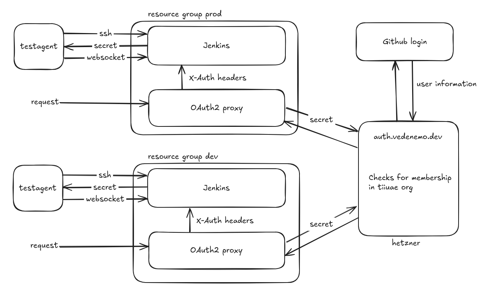

<!--
SPDX-FileCopyrightText: 2022-2025 TII (SSRC) and the Ghaf contributors
SPDX-License-Identifier: CC-BY-SA-4.0
-->
# Jenkins authentication

The Jenkins authentication setup relies on a few pieces working together:

- [Github app](https://github.com/apps/vedenemo-auth) installed in the tiiuae org
  - Callback url `https://auth.vedenemo.dev/callback`
  - Permissions:
    - Organization members: read-only
    - Account email addresses: read-only
- Central authentication server (auth.vedenemo.dev)
  - Config located at /hosts/ghaf-auth/
  - Runs [dex](https://dexidp.io/) with a github connector
  - Has a whitelist of callback addresses for clients
- [Oauth2 Proxy](https://oauth2-proxy.github.io/oauth2-proxy/) on the controller, requests to Jenkins are proxied through here with caddy. Configuration needs to include a client secret that matches the client configured in ghaf-auth.
- The Jenkins controller itself, accessible only through the proxy.

