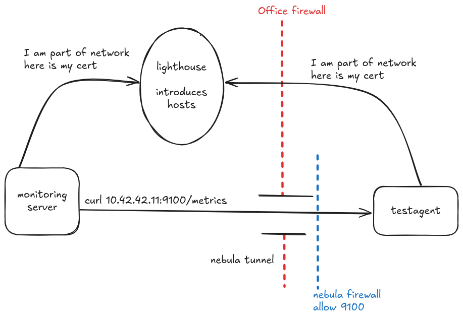

<!--
SPDX-FileCopyrightText: 2022-2025 TII (SSRC) and the Ghaf contributors
SPDX-License-Identifier: CC-BY-SA-4.0
-->

# Nebula overlay network

> [Nebula](https://github.com/slackhq/nebula) is a scalable overlay networking tool with a focus on performance,
simplicity and security. It lets you seamlessly connect computers anywhere in the world.

Nebula is used in ghaf-infra to create a network between servers in the Tampere office and hetzner.



## Lighthouse

Nebula network needs to have at least one "lighthouse" host. This host should be publicly available,
and will introduce any new hosts that join the network.
Note that no traffic flows though the lighthouse, it is simply a discovery node.

Our lighthouse is `ghaf-lighthouse` on hetzner.

The lighthouse can also be used as a DNS server to resolve the host ip addresses.
We have the following DNS records to facilitate this:

```
sumu.vedenemo.dev. 0  NS  sumu.vedenemo.dev.
sumu.vedenemo.dev. 0  A   65.109.141.136
```

Query like `dig monitoring.sumu.vedenemo.dev` will return the nebula address of our monitoring server.
The address if of course only reachable from within the network.

From within the nebula network, and using the nebula address of the lighthouse, you can also query the cert of any host:

```sh
dig @10.42.42.1 10.42.42.11 txt
```

This will tell you the groups that the host (10.42.42.11) is part of, if you forgot.

## Certificate Authority

The CA key and cert are stored encrypted in `services/nebula/ca.{key,crt}`.
These can be decrypted with SOPS, given you have the rights:

```sh
sops decrypt ca.key
```

The current keys have been generated with this command:

```sh
nebula-cert ca --name "Vedenemo CA"
```

Note that the CA has lifetime of 1 year. See how to rotate the keys
[here](https://nebula.defined.net/docs/guides/rotating-certificate-authority)

## Host Certificates

Helper script is provided in `scripts/nebula-sign.sh`, which will decrypt the ca keys into a temporary directory
and run `nebula-cert sign` with the arguments you provide. After exiting, the temporary directory gets deleted.

### Example usage

create new host certificate for `testagent-dev` and assign it the ip address `10.42.42.11` on the nebula network
(Check hosts/machines.nix so you don't pick already occupied address).
This host will be part of the groups `testagent` and `office`.
The groups can be anything and are used to define firewall rules between hosts.

`sumu.vedenemo.dev` has been chosen as the subdomain of our nebula network so all hostnames should be under that.

```sh
./scripts/nebula-sign.sh -name "testagent-dev.sumu.vedenemo.dev" -ip "10.42.42.11/24" -groups "testagent,office"
```

Other groups we are using:
    - hetzner
    - scraper

The script will print the cert and key in a format that can be easily copy-pasted into `secrets.yaml`.

## Nix configuration

To add a new host into the network, you should have the certificate and key in `secrets.yaml`,
then import the `service-nebula` module.

Set secret owner as `config.nebula.user` (this is defined in the module).

```nix
sops.secrets = {
  nebula-cert.owner = config.nebula.user;
  nebula-key.owner = config.nebula.user;
};
```

Then you can enable the nebula module:

```nix
nebula = {
  enable = true;
  cert = config.sops.secrets.nebula-cert.path;
  key = config.sops.secrets.nebula-key.path;
};
```

Remember to update `.sops.yaml` and then run `sops updatekeys services/nebula/ca.crt.crypt`.
The new host should be able to decrypt `ca.crt.crypt` for nebula to run.
