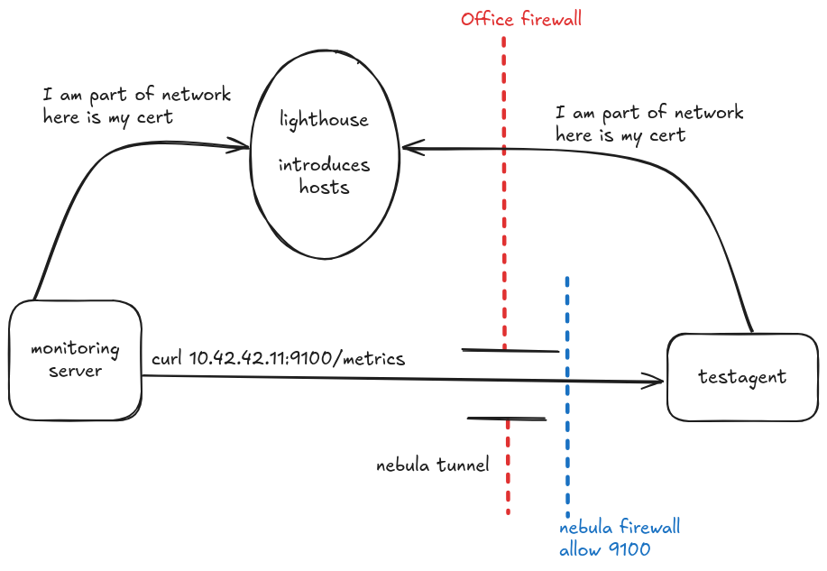

<!--
SPDX-FileCopyrightText: 2022-2025 TII (SSRC) and the Ghaf contributors
SPDX-License-Identifier: CC-BY-SA-4.0
-->

# Nebula overlay network

[Nebula](https://github.com/slackhq/nebula) connects the servers in Hetzner,
the Tampere office, and the UAE over an encrypted overlay network.



## Lighthouse

Nebula network needs to have at least one "lighthouse" host. This host should be publicly available,
and will introduce any new hosts that join the network.
Note that no traffic flows though the lighthouse, it is simply a discovery node.

Our lighthouse is `ghaf-lighthouse` on hetzner.

The lighthouse can also be used as a DNS server to resolve the host ip addresses.
We have the following DNS records to facilitate this:

```
sumu.vedenemo.dev. 0  NS  sumu.vedenemo.dev.
sumu.vedenemo.dev. 0  A   65.109.141.136
```

Query like `dig monitoring.sumu.vedenemo.dev` will return the nebula address of our monitoring server.
The address is only reachable from within the network.

From within the nebula network, and using the nebula address of the lighthouse, you can also query the cert of any host:

```sh
dig @10.42.42.1 10.42.42.11 txt
```

This will tell you the groups that the host (10.42.42.11) is part of, if you forgot.

## Certificate Authority

The CA key and cert are stored encrypted in
`modules/nebula/ca.{key,crt}.crypt`.
These can be decrypted with SOPS, given you have the rights:

```sh
sops decrypt modules/nebula/ca.key.crypt
```

The current keys have been generated with this command:

```sh
nebula-cert ca --name "Vedenemo CA"
```

Note that the CA has lifetime of 1 year. See how to rotate the keys
[here](https://nebula.defined.net/docs/guides/rotating-certificate-authority)

## Host Certificates

Helper script is provided in `scripts/nebula-sign.sh`, which will decrypt the ca keys into a temporary directory
and run `nebula-cert sign` with the arguments you provide. After exiting, the temporary directory gets deleted.

### Example usage

create new host certificate for `testagent-dev` and assign it the ip address `10.42.42.11` on the nebula network
(Check `hosts/machines.nix` so you don't pick an already occupied address).
This host will be part of the groups `testagent` and `office`.
The groups can be anything and are used to define firewall rules between hosts.

`sumu.vedenemo.dev` has been chosen as the subdomain of our nebula network so all hostnames should be under that.

```sh
./scripts/nebula-sign.sh -name "testagent-dev.sumu.vedenemo.dev" -ip "10.42.42.11/24" -groups "testagent,office"
```

Other groups include `hetzner` and `scraper`. See [Firewall groups](#firewall-groups).

The script will print the cert and key in a format that can be easily copy-pasted into `secrets.yaml`.

### Renewing host certificates

Before renewing host certificates during a CA rotation, follow the
[Nebula CA rotation guide](https://nebula.defined.net/docs/guides/rotating-certificate-authority/):
append the new CA certificate to `modules/nebula/ca.crt.crypt` and deploy that
trust bundle to every Nebula host. Keep the old CA in the bundle until every
host uses a certificate signed by the new CA.

Renew all host certificates stored in SOPS with:

```sh
inv renew-nebula-certificates
```

To renew only selected hosts, pass their aliases:

```sh
inv renew-nebula-certificates --aliases ghaf-lighthouse,ghaf-monitoring
```

The task decrypts each existing `nebula-cert`, preserves its name, networks,
and groups, and signs a new certificate and private key. It then replaces only
`nebula-cert` and `nebula-key` in the same SOPS file. CA and host private keys
exist only in a temporary directory and are removed when the task exits.

Deploy the updated hosts and verify Nebula connectivity before removing the old
CA from `modules/nebula/ca.crt.crypt`. Deploy the final single-CA trust bundle
to every host.

## Nix configuration

To add a new host into the network, add the certificate and key to `secrets.yaml`
as `nebula-cert` and `nebula-key`, import the `nebula` module, and enable it:

```nix
nebula.enable = true;
```

Remember to update `.sops.yaml` and then run `sops updatekeys modules/nebula/ca.crt.crypt`.
The new host should be able to decrypt `ca.crt.crypt` for nebula to run.

## Onboarding checklist

These steps assume the host is already installed. For a new machine, start
with [adding a host](./adding-a-host.md).

1. Choose the next free `10.42.42.x` address by checking
   existing `nebula_ip` values in `hosts/machines.nix`.
2. Select the appropriate groups for the host (see
   [firewall groups](#firewall-groups) below).
3. Run `./scripts/nebula-sign.sh` with the chosen
   name, IP, and groups:
   ```sh
   ./scripts/nebula-sign.sh -name "<name>.sumu.vedenemo.dev" -ip "10.42.42.x/24" -groups "group1,group2"
   ```
4. Copy the script output into the host's
   `secrets.yaml` (the `nebula-cert` and `nebula-key` fields).
5. In `.sops.yaml`, add the host's age key anchor to the
   `modules/nebula/ca.crt.crypt` creation rule so the host can decrypt it.
6. Run `sops updatekeys modules/nebula/ca.crt.crypt`.
7. Import the `nebula` module in the host's
   `configuration.nix` and enable it (see [Nix configuration](#nix-configuration)
   above).
8. Set the `nebula_ip` field in `hosts/machines.nix`
   under the host's `machine` attrset.
9. Deploy the host with `deploy .#<name>`.

## Firewall groups

Groups are assigned when signing a host certificate and are used in the
shared firewall rules in `modules/nebula/default.nix` and host-specific rules.

| Group | Purpose |
|---|---|
| `hetzner` | Hetzner cloud nodes |
| `office` | Tampere office nodes |
| `testagent` | Test agent machines |
| `scraper` | Metrics scraping (ghaf-monitoring) |
| `azureci` | UAE Azure cloud nodes |
| `uae-lab` | UAE lab nodes |
| `masdar` | UAE masdar nodes |

Only `scraper` and `hetzner` currently appear in firewall rules. The other
groups are descriptive labels and do not grant additional access.

The shared inbound rules allow connections from peers in the `scraper`
group, including ghaf-monitoring, to node-exporter (9100/tcp) and Nebula
metrics (9101/tcp). The hosts being scraped do not need the `scraper` group.

Host-specific rules also use groups. For example, the NetHSM gateways allow
outbound UDP on port 4242 only to peers in `hetzner`. Check the host
configuration as well as the shared module when choosing groups.
