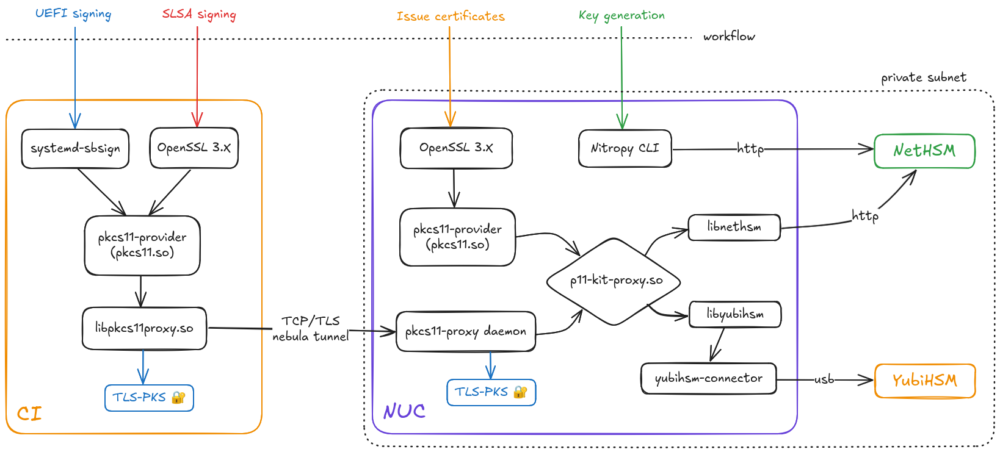

<!--
SPDX-FileCopyrightText: 2022-2025 TII (SSRC) and the Ghaf contributors
SPDX-License-Identifier: CC-BY-SA-4.0
-->

# NetHSM



`nethsm-gateway` runs a daemon provided by
[pkcs11-proxy](https://github.com/tiiuae/pkcs11-proxy).

This daemon is listening on tls port 2345, accessible through the nebula tunnel
from the hetzner CI. A library provided by the same project can be used as the
pkcs11 module, which will proxy the requests to the correct place (configured
through environment variables).

The requests are encrypted with a PKS key which comes from the host secrets.

Signing operations can be done from Hetzner CI, with configured pkcs11-proxy.
The keys used will be the ones stored on the NetHSM.

## SLSA Signing

Signing of blobs is done through openssl with the keys stored in the NetHSM.

- `GhafInfraSignECP256`: ECDSA, Used for signing binaries
- `GhafInfraSignProv`: EDDSA, Used for signing provenance files
- `GhafInfraSignBin`: EDDSA, Ideally would be used for signing binaries (TODO)

### Provenance

Normally signing would be done with the `openssl dgst` commands, but since it
does not support ED25519 keys, `pkeyutl` has to be used instead.

Create signature:

```sh
openssl pkeyutl -sign \
    -inkey "pkcs11:token=NetHSM;object=GhafInfraSignProv" \
    -in provenance.json -rawin \
    -out provenance.json.sig
```

Verify signature:

```sh
openssl pkeyutl -verify \
    -inkey "pkcs11:token=NetHSM;object=GhafInfraSignProv" -pubin \
    -in provenance.json -rawin \
    -sigfile provenance.json.sig
```

### Disk images

`pkeyutl` will not hash the file, but uses the raw file as the input for the
signature. Since disk images are so large, the operation performed by pkeyutl
with EDDSA keys will fail. We have to use ECDSA key for signing the images (for
now).

Create signature:

```sh
openssl dgst -sha256 -sign \
    "pkcs11:token=NetHSM;object=GhafInfraSignECP256" \
    -out disk1.raw.zst.sig \
    disk1.raw.zst
```

Verify signature:

```sh
penssl dgst -verify \
    "pkcs11:token=NetHSM;object=GhafInfraSignECP256" \
    -signature disk1.raw.zst.sig \
    disk1.raw.zst
```
