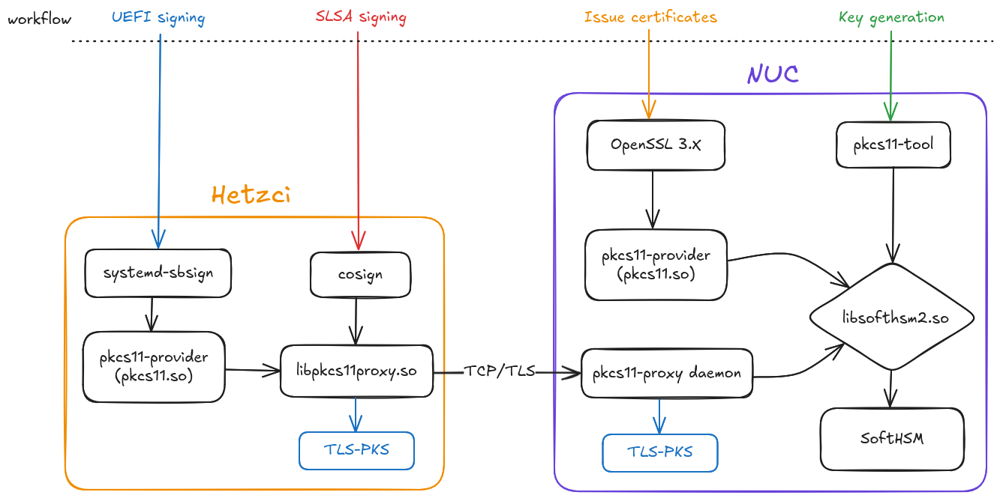

<!--
SPDX-FileCopyrightText: 2022-2025 TII (SSRC) and the Ghaf contributors
SPDX-License-Identifier: CC-BY-SA-4.0
-->

# Signing



## Softhsm usage

Manual steps of how the softhsm is used. This can be automated with scripts in
the future.

All commands should be ran on the nethsm-gateway server.

### Creating softhsm signing keys

> Prerequisite of key creation is that you are in the `nethsm` group.

First define the pins as variables:

```sh
export PIN=1234
export SO_PIN=123456
export TOKEN=testkey
```

Init new softhsm token slot:

```sh
softhsm2-util --init-token --free --label $TOKEN --so-pin $SO_PIN --pin $PIN

# or populate the SLOT automatically
export SLOT=$(
    softhsm2-util --init-token --free --label $TOKEN \
    --so-pin $SO_PIN --pin $PIN | grep "to slot " | awk '{print $NF}'
) && echo $SLOT
```

It will print the slot number to use in following commands. Save this to a
variable as well:

```sh
export SLOT=391264627 # replace with the randomly assigned slot you got back
```

```sh
pkcs11-tool --module $HSM_MODULE -p $PIN --slot $SLOT \
            --keypairgen --key-type rsa:4096 --label "PK-key" --id 01

pkcs11-tool --module $HSM_MODULE -p $PIN --slot $SLOT \
            --keypairgen --key-type rsa:4096 --label "KEK-key" --id 02

pkcs11-tool --module $HSM_MODULE -p $PIN --slot $SLOT \
            --keypairgen --key-type rsa:4096 --label "DB-key" --id 03
```

Verify keys are there. You should see 3 public keys and 3 private keys.

```sh
pkcs11-tool --module $HSM_MODULE -p $PIN --slot $SLOT --list-objects
```

### Creating certificates

> `$CERTSDIR` is defined in the system configuration.

Now you can use the created private keys to generate x509 certificates:

```sh
# PK
openssl req -new -x509 -sha256 -days 365 \
        -key "pkcs11:token=$TOKEN;object=PK-key;type=private;pin-value=$PIN" \
        -config $OPENSSL_EXTRA_CONF/create_PK_cert.ini \
        -out $CERTSDIR/pk.crt
# KEK
openssl req -new -x509 -sha256 -days 365 \
        -key "pkcs11:token=$TOKEN;object=KEK-key;type=private;pin-value=$PIN" \
        -config $OPENSSL_EXTRA_CONF/create_KEK_cert.ini \
        -out $CERTSDIR/kek.crt
# DB
openssl req -new -x509 -sha256 -days 365 \
        -key "pkcs11:token=$TOKEN;object=DB-key;type=private;pin-value=$PIN" \
        -config $OPENSSL_EXTRA_CONF/create_DB_cert.ini \
        -out $CERTSDIR/db.crt
```

You can import these certificates into the softhsm:

```sh
pkcs11-tool --module $HSM_MODULE -p 1234 --slot $SLOT \
            --write-object $CERTSDIR/pk.crt --type cert --label PK-cert

pkcs11-tool --module $HSM_MODULE -p 1234 --slot $SLOT \
            --write-object $CERTSDIR/kek.crt --type cert --label KEK-cert

pkcs11-tool --module $HSM_MODULE -p 1234 --slot $SLOT \
            --write-object $CERTSDIR/db.crt --type cert --label DB-cert
```

### Exporting public keys

The public keys can be exported for enrollment to UEFI if needed.

```sh
pkcs11-tool --module $HSM_MODULE -p $PIN --slot $SLOT \
            --read-object --type pubkey --label PK-key -o $CERTSDIR/pk.der
pkcs11-tool --module $HSM_MODULE -p $PIN --slot $SLOT \
            --read-object --type pubkey --label KEK-key -o $CERTSDIR/kek.der
pkcs11-tool --module $HSM_MODULE -p $PIN --slot $SLOT \
            --read-object --type pubkey --label DB-key -o $CERTSDIR/db.der
```

## PKCS11 proxy

`nethsm-gateway` runs a daemon provided by
[pkcs11-proxy](https://github.com/scobiej/pkcs11-proxy/tree/osx-openssl1-1).

This daemon is listening on tls port 2345, accessible through the nebula tunnel
from the hetzner CI. A library provided by the same project can be used as the
pkcs11 module, which will proxy the requests to the correct place (configured
through environment variables).

The requests are encrypted with a PKS key which comes from the host secrets.

Substitute the variables in the following commands (except
`PKCS11_PROXY_MODULE`, that one is populated on the system) with values from the
softhsm setup earlier.

### Signing and verifying using cosign

Given an arbitrary file `hello`, and signing key `SLSA-key` with both private
and public keys on the HSM (creation left as exercise for the reader):

```sh
cosign sign-blob --yes \
    --key "pkcs11:token=$TOKEN;slot-id=$SLOT;object=SLSA-key;pin-value=$PIN?module-path=$PKCS11_PROXY_MODULE" \
    --output-file hello.sig \
    hello
```

Now you have hello and hello.sig files. Verify the signature like so:

```sh
cosign verify-blob \
    --key "pkcs11:token=$TOKEN;slot-id=$SLOT;object=SLSA-key;type=pubkey;pin-value=$PIN?module-path=$PKCS11_PROXY_MODULE" \
    --signature hello.sig \
    hello
```

### UEFI Signing

Sign your EFI bootloader using private key and certificate stored on the
softhsm. `systemd-sbsign` can use the openssl pkcs11 provider to pull those
objects. When the pkcs11-provider is configured to use the pkcs11-proxy module,
this integration is seamless.

```sh
systemd-sbsign sign \
    --private-key-source provider:pkcs11 \
    --private-key "pkcs11:token=$TOKEN;object=DB-key;type=private;pin-value=$PIN" \
    --certificate-source provider:pkcs11 \
    --certificate "pkcs11:token=$TOKEN;object=DB-cert;type=cert;pin-value=$PIN" \
    --output SIGNED_BOOT.EFI \
    YOUR_BOOT.EFI
```
